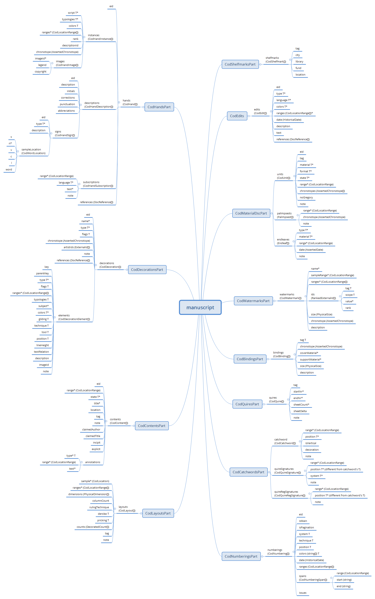

# Cadmus.Codicology

- [Cadmus.Codicology](#cadmuscodicology)
  - [Bricks](#bricks)
  - [Parts](#parts)
    - [CodBindingsPart](#codbindingspart)
    - [CodQuireLabelsPart](#codquirelabelspart)
    - [CodContentsPart](#codcontentspart)
    - [CodDecorationsPart](#coddecorationspart)
    - [CodEditsPart](#codeditspart)
    - [CodHandsPart](#codhandspart)
    - [CodLayoutsPart](#codlayoutspart)
    - [CodMaterialDscPart](#codmaterialdscpart)
    - [CodNumberingsPart](#codnumberingspart)
    - [CodQuiresPart](#codquirespart)
    - [CodShelfmarksPart](#codshelfmarkspart)
    - [CodWatermarksPart](#codwatermarkspart)

This solution contains a number of Cadmus parts related to codicology, originally stemming from the Itinera project, but designed to be generic enough to be useful in other projects.

## Bricks

The models of some bricks are summarized here for the reader's commodity.

- **PhysicalSize**:

  - tag (string) T:physical-size-tags
  - w\* (**PhysicalDimension**):
    - tag (string) T:physical-size-dim-tags
    - value\* (number)
    - unit\* (string) T:physical-size-units
  - h (PhysicalDimension)
  - d (PhysicalDimension)
  - note (string)

- **HistoricalDate**:
  - a\* (Datation):
    - value\* (int)
    - isCentury (boolean)
    - isSpan (boolean)
    - isApproximate (boolean)
    - isDubious (boolean)
    - day (int)
    - month (int)
    - hint (string
  - b (Datation)

- **CodLocation**:

  - endleaf (int): 0=none 1=start 2=end
  - s (string): system
  - n\* (int): sheet number
  - rmn (boolean): Roman system for n
  - sfx (string): arbitrary suffix
  - v (boolean?): verso or recto or unspecified/not-applicable
  - c (string): column
  - l (string): line

- **CodLocationRange**:

  - start\* (CodLocation)
  - end\* (CodLocation)

- **DocReference**:

  - type (string) T:doc-reference-types
  - tag (string) T:doc-reference-tags
  - citation\* (string)
  - note (string)

- **Assertion**:

  - tag (string) T:assertion-tags
  - rank\* (number)
  - note (string)
  - references (DocReference[]) T:doc-reference-types, T:doc-reference-tags

- **AssertedPlace**:

  - tag (string) T:asserted-place-tags
  - value\* (string)
  - assertion (Assertion) T:assertion-tags, T:doc-reference-types, T:doc-reference-tags

- **AssertedDate**: equal to `HistoricalDate` plus:

  - tag (string) T:asserted-date-tags
  - assertion (Assertion) T:assertion-tags, T:doc-reference-types, T:doc-reference-tags

- **AssertedChronotope**:

  - place (AssertedPlace) T:chronotope-tags, T:assertion-tags, T:doc-reference-types, T:doc-reference-tags
  - date (AssertedDate) T:chronotope-tags, T:assertion-tags, T:doc-reference-types, T:doc-reference-tags

## Parts

### CodBindingsPart

ID: `it.vedph.codicology.bindings`

- bindings (CodBinding[]):
  - tag (string) T:cod-binding-tags
  - coverMaterial\* (string) T:cod-binding-cover-materials
  - boardMaterial\* (string) T:cod-binding-board-materials
  - chronotope\* (AssertedChronotope) T:assertion-tags, T:doc-reference-types, T:doc-reference-tags
  - size (PhysicalSize) T:physical-size-tags, T:physical-size-dim-tags, T:physical-size-units
  - description (string)

### CodQuireLabelsPart

Catchwords and signatures applied to manuscript's quires.

ID: `it.vedph.codicology.quire-labels`

- catchwords (CodCatchword[]):
  - range\* (CodLocationRange)
  - position\* (string) T:cod-catchwords-positions
  - isVertical (boolean)
  - decoration (string)
  - note (string)
- quireSignatures (CodQuireSignature[]):
  - range\* (CodLocationRange)
  - position\* (string) T:cod-quiresig-positions
  - system\* (string) T:cod-quiresig-systems
  - note (string)
- quireRegSignatures (CodQuireRegSignature[]):
  - range\* (CodLocationRange)
  - position\* (string) T:cod-quiresig-positions
  - note (string)

### CodContentsPart

ID: `it.vedph.codicology.contents`

- contents (CodContent[]):
  - eid (string)
  - range\* (CodLocationRange)
  - state\* (string) T:cod-content-states
  - title\* (string)
  - location (string)
  - claimedAuthor (string)
  - claimedTitle (string)
  - tag (string) T:cod-content-tags
  - note (string)
  - incipit (string)
  - explicit (string)
  - annotations (CodContentAnnotation[]):
    - type\* (string) T:cod-content-annotation-types
    - range\* (CodLocationRange)
    - incipit\* (string)
    - explicit\* (string)
    - text\* (string)

### CodDecorationsPart

ID: `it.vedph.codicology.decorations`

- decorations (CodDecoration[]):
  - eid (string)
  - name\* (string)
  - type\* (string) T:cod-decoration-types
  - flags (string) T:cod-decoration-flags
  - chronotopes (AssertedChronotope[]) T:assertion-tags, T:doc-reference-types, T:doc-reference-tags
  - artist (CodDecorationArtist):
    - eid (string)
    - type\* (string) T:cod-decoration-artist-types
    - name\* (string)
    - ids (ExternalId[])
    - note (string)
  - note (string)
  - references (DocReference[]) T:doc-reference-types, T:doc-reference-tags
  - elements (CodDecorationElement[]):
    - key (string)
    - parentKey (string)
    - type\* (string) T:cod-decoration-element-types
    - flags (string) T:cod-decoration-element-flags
    - ranges\* (CodLocationRange[])
    - typologies (string) T:cod-decoration-element-typologies
    - subject (string)
    - colors (string[]) T:cod-decoration-element-colors
    - gilding (string) T:cod-decoration-element-gildings
    - technique (string) T:cod-decoration-element-techniques
    - tool (string) T:cod-decoration-element-tools
    - position (string) T:cod-decoration-element-positions
    - lineHeight (int)
    - textRelation (string)
    - description (string MD)
    - images (CodImage[]):
      - id\* (string)
      - type\* (string)
      - sourceId (string)
      - label (string)
      - copyright (string)
    - note (string)

### CodEditsPart

ID: `it.vedph.codicology.edits`

Specialized events related to any kind of text editing on the manuscript.

- edits (CodEdit[]):
  - eid (string)
  - type\* (string) T:cod-edit-types
  - technique\* (string) T:cod-edit-techniques
  - ranges\* (CodLocationRange[])
  - language (string) T:cod-edit-languages
  - colors (string[]) T:cod-edit-colors
  - date (HistoricalDate)
  - description (string)
  - text (string)
  - references (DocReference[]) T:doc-reference-types, T:doc-reference-tags

### CodHandsPart

ID: `it.vedph.codicology.hands`

- hands (CodHand[]):
  - eid (string)
  - name (string)
  - instances (CodHandInstance)
    - script\* (string) T:cod-hand-scripts
    - typologies\* (string[]) T:cod-hand-typologies
    - colors (string[]) T:cod-hand-colors
    - ranges\* (CodLocationRange[])
    - rank (short)
    - descriptionId (string)
    - chronotope (AssertedChronotope) T:assertion-tags, T:doc-reference-types, T:doc-reference-tags
    - images (CodImage[]):
      - id\* (string)
      - type\* (string) T:cod-image-types
      - sourceId (string)
      - label (string)
      - copyright (string)
  - descriptions (CodHandDescription[]):
    - id (string): this is referenced by `CodHandInstance.descriptionId`
    - description (string)
    - initials (string)
    - corrections (string)
    - punctuation (string)
    - abbreviations (string)
    - signs (CodHandSign[]):
      - eid (string)
      - type\* (string) T:cod-hand-sign-types
      - sampleLocation\* (CodLocation)
      - description (string)
  - subscriptions (CodHandSubscription[]):
    - range\* (CodLocationRange)
    - language\* (string) T:cod-hand-subscription-languages
    - text (string)
    - note (string)
  - references (DocReference[]) T:doc-reference-types, T:doc-reference-tags

### CodLayoutsPart

ID: `it.vedph.codicology.layouts`

- layouts (CodLayout[]):
  - sample\* (CodLocation)
  - ranges\* (CodLocationRange[])
  - dimensions (PhysicalDimension[]) T for dimension tag: cod-layout-dimension-tags, T:physical-size-dim-tags, T:physical-size-units
  - rulingTechnique (string) T:cod-layout-ruling-techniques
  - derolez (string) T:cod-layout-derolez
  - pricking (string) T:cod-layout-prickings
  - columnCount\* (int)
  - counts (DecoratedCount[]):
    - id* (string) T:cod-layout-counts
    - value* (int)
    - note (string)
  - tag (string) T:cod-layout-tags
  - note (string)

### CodMaterialDscPart

ID: `it.vedph.codicology.material-dsc`

- units (CodUnit[]):
  - eid (string)
  - tag (string) T:cod-unit-tags
  - material\* (string) T:cod-unit-materials
  - format\* (string) T:cod-unit-formats
  - state\* (string) T:cod-unit-states
  - range\* (CodLocationRange)
  - chronotopes\* (AssertedChronotope[]) T:assertion-tags, T:doc-reference-types, T:doc-reference-tags
  - noGregory (boolean)
  - note (string)
- palimpsests (CodPalimpsest[]):
  - range\* (CodLocationRange)
  - chronotope (AssertedChronotope) T:assertion-tags, T:doc-reference-types, T:doc-reference-tags
  - note (string)
- endleaves (CodEndleaf[]):
  - type\* (string) T:cod-endleaf-types
  - material\* (string) T:cod-endleaf-materials
  - range\* (CodLocationRange)
  - chronotope (AssertedChronotope)
  - note (string)

### CodNumberingsPart

ID: `it.vedph.codicology.numberings`

Numberings on the manuscript's sheets. Each numbering system is fully described. One system is defined as the main system. This is the default reference system for manuscript locations.

While `ranges` represents the global extent of the numbering system in the manuscript, `spans` provides more details by specifying the extent of each span of regular numbering as related to some reference system. Each numbering span is defined with reference to a range in the system used as base (usually corresponding to the current physical state of the manuscript, where the first sheet is 1, the second is 2, etc.), and has a start value and an end value. It is assumed that all the values in between can be calculated according to the numbering system the span refers to (e.g. 1,2,3... or i,ii,iii... or A,B,C... etc.); so, whenever there is some incongruence we must start a new span.

- numberings (CodNumbering[]):
  - eid (string)
  - isMain (boolean)
  - isPagination (boolean)
  - system\* (string) T:cod-numbering-systems
  - technique\* (string) T:cod-numbering-techniques
  - position\* (string) T:cod-numbering-positions
  - colors (string[]) T:cod-numbering-colors
  - date (HistoricalDate)
  - ranges\* (CodLocationRange[])
  - spans (CodNumberingSpan[]):
    - range (CodLocationRange)
    - start (string)
    - end (string)
  - issues (string)

### CodQuiresPart

ID: `it.vedph.codicology.quires`

- quires (CodQuire[]):
  - tag (string) T:cod-quire-tags
  - startNr\* (number)
  - endNr\* (number)
  - sheetCount\* (number)
  - sheetDelta (number)
  - note (string)

### CodShelfmarksPart

ID: `it.vedph.codicology.shelfmarks`.

Manuscript's shelfmark(s). Usually there is just one, unless you are also adding some historical signatures; in this case, assign a tag to the non-current (default) one.

- shelfmarks (CodShelfmark[]):
  - tag (string) T:cod-shelfmark-tags
  - city\* (string)
  - library\* (string) T:cod-shelfmark-libraries
  - fund (string)
  - location\* (string)

### CodWatermarksPart

ID: `it.vedph.codicology.watermarks`

Manuscript's watermarks.

- watermarks (CodWatermark[]):
  - name\* (string)
  - sampleRange\* (CodLocationRange)
  - ranges (CodLocationRange[])
  - ids (RankedExternalId[])
  - size (PhysicalSize) T:physical-size-tags, T:physical-size-dim-tags, T:physical-size-units
  - chronotope (AssertedChronotope) T:assertion-tags, T:doc-reference-types, T:doc-reference-tags
  - description (string)
